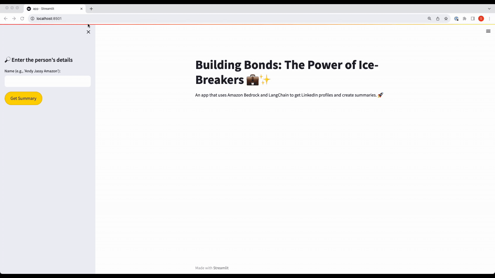

 

<h1 align="center">☁️🐍 Getting Started with Amazon Bedrock, RAG, and Vector database in Python</h1>

### 🔍 Introduction
In this repository, you'll find sample applications and tutorials that showcase the power of **Amazon Bedrock with Python**. These resources are designed to help Python developers understand how to harness **Amazon Bedrock** in building generative AI-enabled applications. You'll also discover how to integrate Bedrock with vector databases using `RAG (Retrieval-augmented generation)`, and services like Amazon Aurora, RDS, and OpenSearch. Additionally, get insights into using `langchain` and `streamlit` to create applications that demonstrate your experiments effectively.

### 📑 Table of Contents
- [Stable Diffusion AI Application](#integrated-fullstack-showcase)
- [Resume Screening Application](#resume-screening-app)
- [Building Bonds Application](#building-bonds)
- [Data Analysis Tool](#data-analysis-tool)
- [Getting Started](#getting-started)

### 🚀 Integrated Fullstack Showcase
Harness the power of Stable Diffusion AI using Amazon Bedrock.
- 🖥 [Live Demo](https://main.d1zbstr6nltjhw.amplifyapp.com/)
- 📖 [Guide & Setup](image-generation-node-js-app/README.md)
- 🌠 Key Features:
    - Seamless integration: Lambda, API Gateway, Bedrock, Amplify
    - Deployment via Serverless stack.

### 📄 Resume Screening App
Streamline resume screening based on specific job descriptions.
- 📖 [Guide & Setup](resume-screening-app/README.md)
- 🌠 Key Features:
    - Seamless integration with Streamlit.
    - Efficient backend with Amazon Bedrock and Aurora.

### 🤝 Building Bonds
Revolutionize introductions by fetching LinkedIn profiles and generating engaging summaries.
- 📖 [Guide & Setup](building-bonds/README.md)
- 🌠 Key Features:
    - Instant LinkedIn profile retrieval.
    - Automated summaries & ice-breakers via Amazon Bedrock and LangChain.

### 📊 Data Analysis Tool
Analyze CSV data with a streamlined Streamlit application.
- 📖 [Guide & Setup](data-analysis-tool/README.md)
- 🌠 Key Features:
    - Smooth UI with Streamlit.
    - Advanced functions via Langchain.

### 💼 **Getting Started**

1. 📥 Clone this repository.
2. 🗂 Navigate to the desired project directory:
    - **Resume Screening App**: [README guide](resume-screening-app/README.md).
    - **Building Bonds**: [README guide](building-bonds/README.md).
    - **Stable Diffusion AI App**: [README guide](image-generation-node-js-app/README.md).
    - **Data Analysis Tool**: [README guide](data-analysis-tool/README.md).
3. 🔧 Set up a virtual environment, `.env` files, and install dependencies as outlined in each README.
4. 🚀 Launch the desired Streamlit app and delve in!

### 🔒 **Security**
[See more on security](CONTRIBUTING.md#security-issue-notifications).

### 📜 **License**
Licensed under the MIT-0 License. [View License](LICENSE).