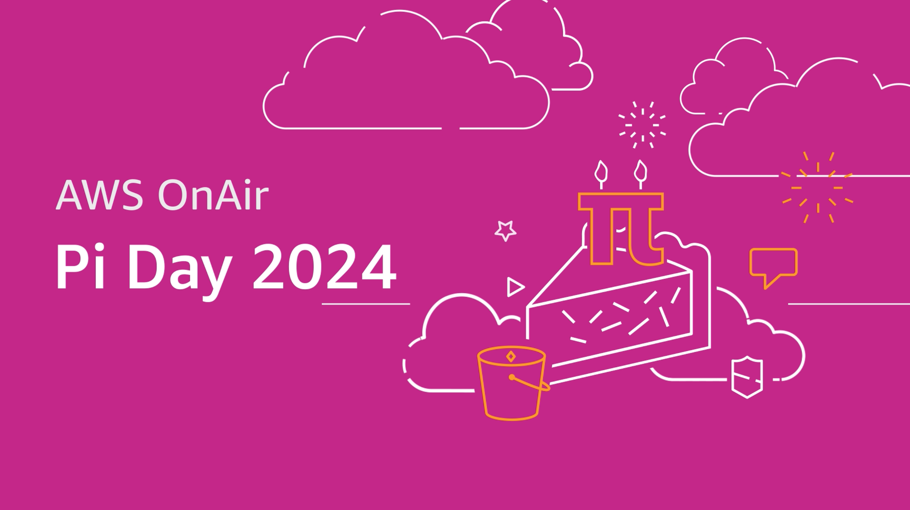
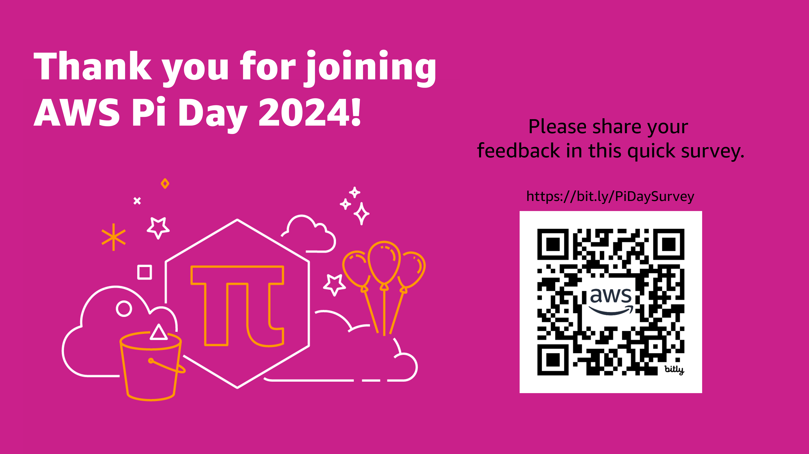

# AWS Pi Day 2024 🚀

Welcome to the [AWS Pi Day 2024](https://pages.awscloud.com/NAMER-event-OE-2024-Pi-Day-2024-interest) repository, where you can explore various applications and examples using Amazon Bedrock, fine-tuning, and Retrieval-Augmented Generation (RAG)! 🎉

## What's Inside 📦

### Notebooks 📓

- [Getting_started.ipynb](01_Getting_started.ipynb) - An introduction to Amazon Bedrock and its usage with the Python SDK and UI. Discover the serverless experience and how to integrate foundation models (FMs) using AWS tools. 🌐

- [Bedrock_KB.ipynb](02_Bedrock_KB.ipynb) - A deep dive into building a Q&A application using the Knowledge Bases for Amazon Bedrock - Retrieve API. Learn to connect to your data for enhanced, context-aware responses from Anthropic Claude V2. 🔍

- [Vectors_RAG_Aurora.ipynb](04_Vectors_RAG_Aurora.ipynb) - Explore the basics of vector embeddings and the use of Amazon Aurora as a vector store on AWS with Bedrock. 📊

### Applications 🖥️

- [Resume_Screening_App](04.Resume_Screening_App) - Streamline your recruitment process with a Streamlit application for effective résumé screening. 📂

- [Bedrock_Claude_Chat](01.Bedrock_Claude_Chat) - An end-to-end sample chatbot using the Anthropic company's LLM Claude, one of the foundational models provided by Amazon Bedrock for generative AI. 💬

- [FineTuning_Bedrock](03.FineTuning_Bedrock) - Examples related to fine-tuning Bedrock models, including code for fine-tuning Meta Llama 2 for text summarization. 🛠️

### Foundation Models 🏗️

Amazon Bedrock supports a range of industry-leading foundation models. Choose the model that best suits your unique goals and begin innovating. 🎯

## Setup and Requirements 🧰

To get started:

1. Clone this repository.
2. Install the dependencies listed in `requirements.txt`.
3. Explore the notebooks and applications provided.

For detailed setup, refer to each example and application's specific documentation.

## Repository Structure 🗂️

Here's a quick overview of what you'll find in this repository:

- 📚 Notebooks
  - [Getting_started.ipynb](01_Getting_started.ipynb)
  - [Bedrock_KB.ipynb](02_Bedrock_KB.ipynb)
  - [Bedrock_KB_Langchain_with_op.ipynb](02.1_Bedrock_KB_Langchain_with_op.ipynb)
  - [Vectors_RAG_Aurora.ipynb](04_Vectors_RAG_Aurora.ipynb)
  - ...and more!
- 📁 Applications
  - [Bedrock_Claude_Chat](01.Bedrock_Claude_Chat)
  - [Resume_Screening_App](04.Resume_Screening_App)
  - ...and more!

## Thank You 🙏

## Contributing ✨

Contributions are what make the open-source community such an amazing place to learn, inspire, and create. Any contributions

## Security 🔒
[See more on security](CONTRIBUTING.md#security-issue-notifications).

## License 📜 
Licensed under the MIT-0 License. [View License](LICENSE).